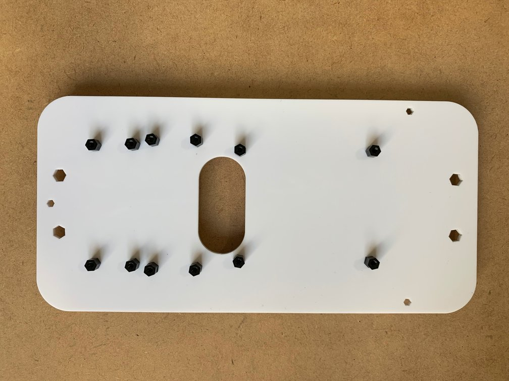
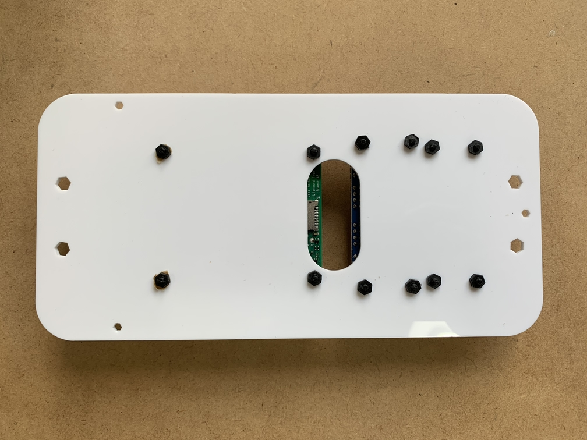
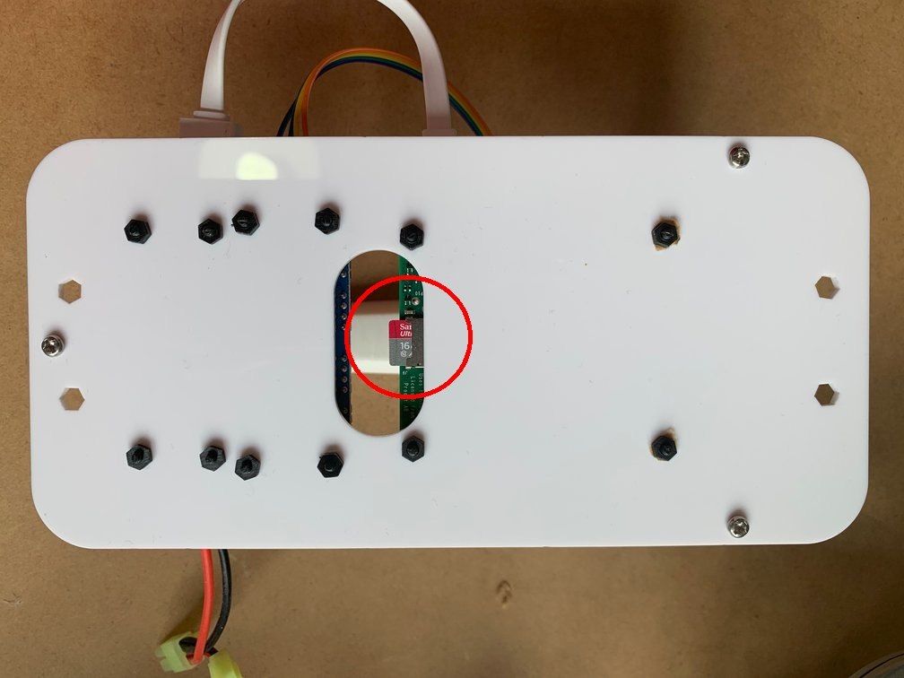
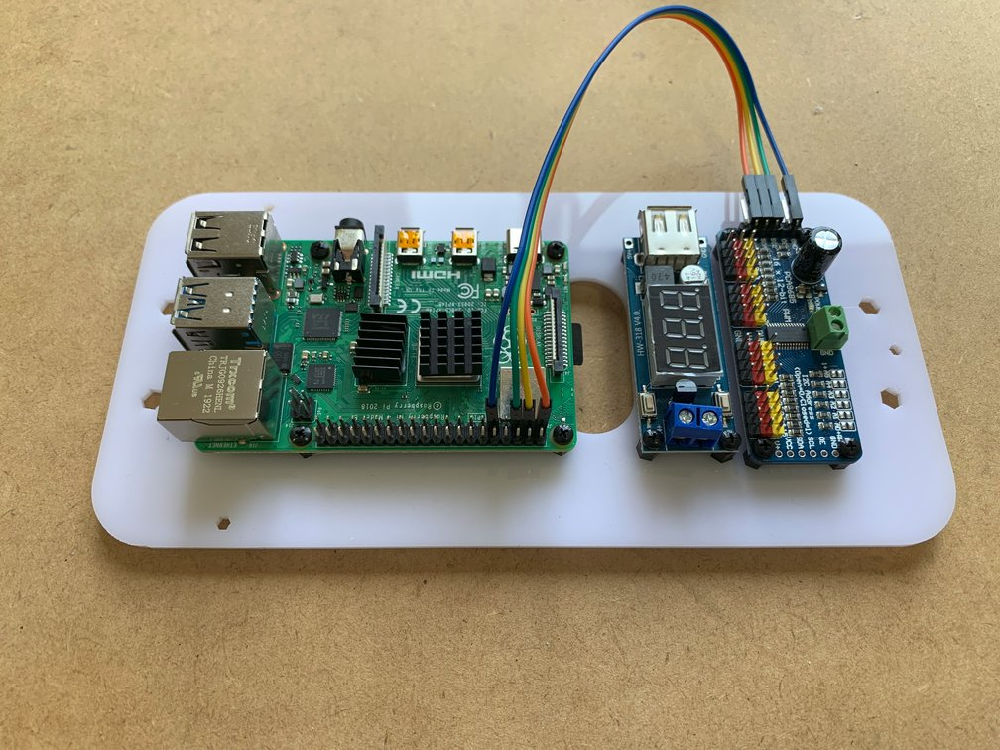
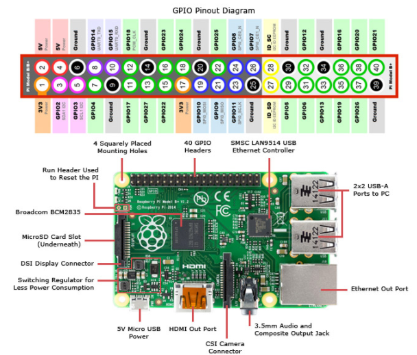
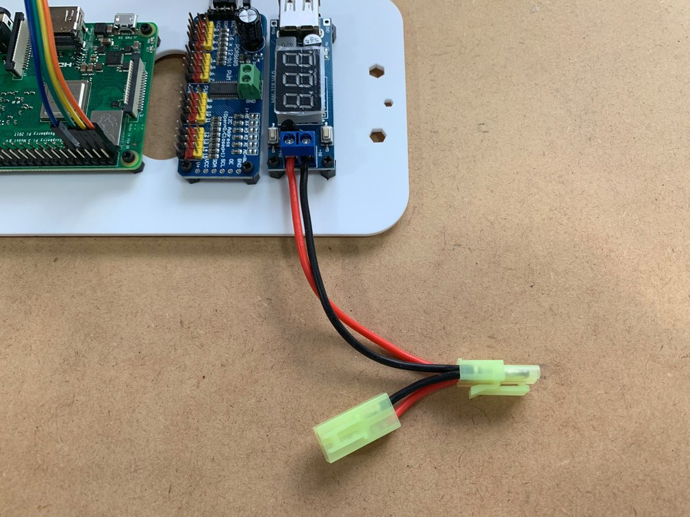
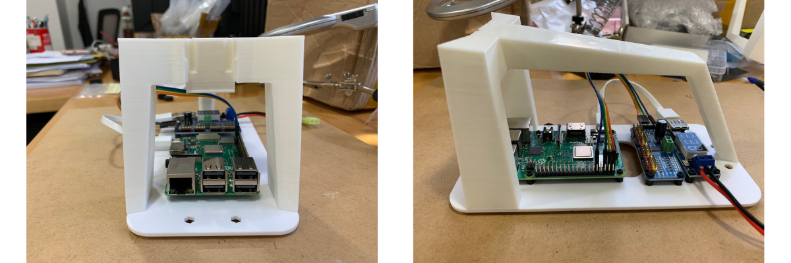
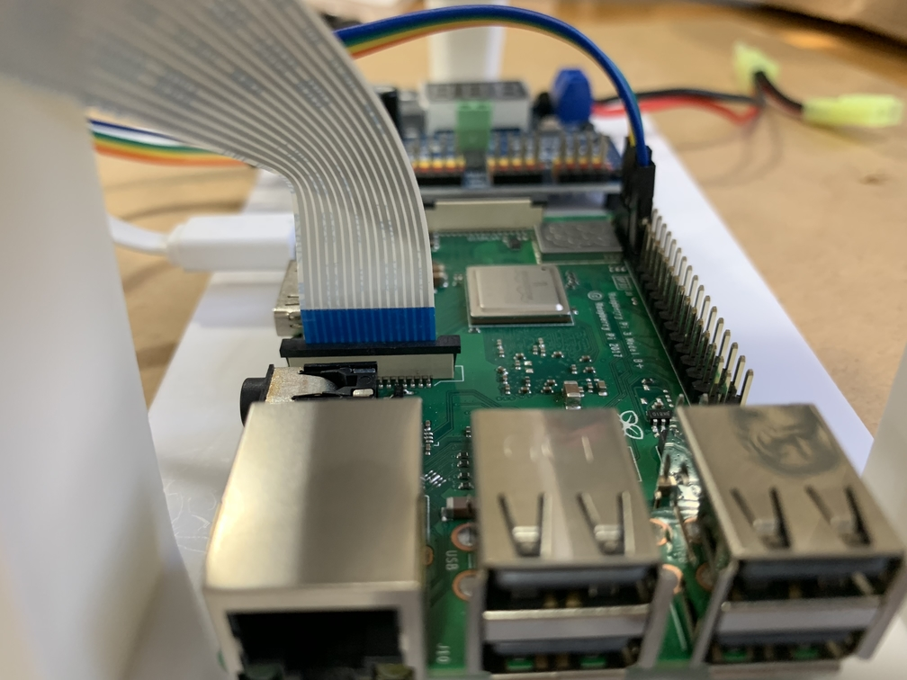
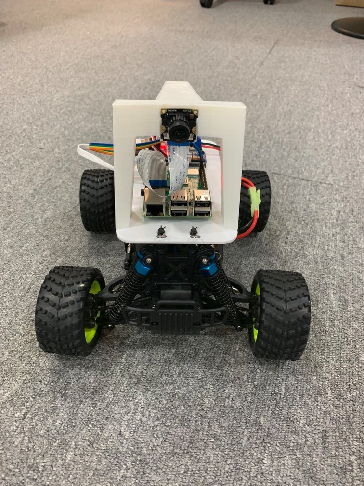
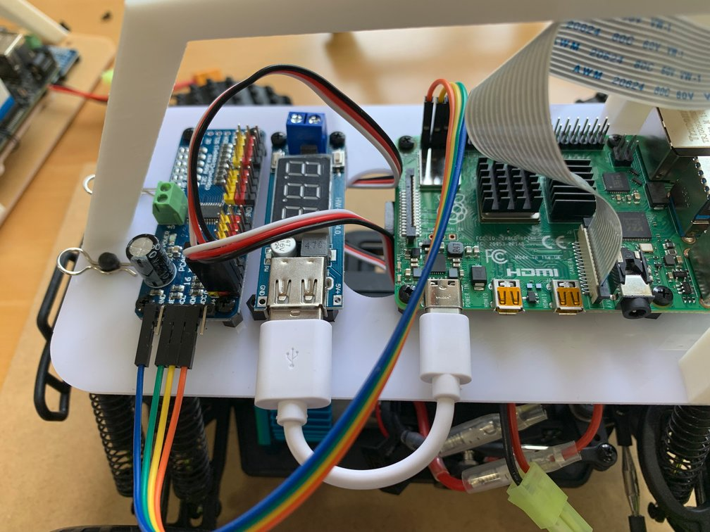

# How to Build a Donkey V2

&nbsp;

* [Overview](build_hardware.md#overview)
* [Parts Included](build_hardware.md#parts-included)
* [Hardware:](build_hardware.md#hardware)
  * [Step 1: Print Parts](build_hardware.md#step-1-print-parts)
  * [Step 2: Clean up parts](build_hardware.md#step-2-clean-up-parts)
  * [Step 3: Assemble Top plate and Roll Cage](build_hardware.md#step-3-assemble-top-plate-and-roll-cage)
  * [Step 4: Connect Servo Shield to Raspberry Pi](build_hardware.md#step-4-connect-servo-shield-to-raspberry-pi)
  * [Step 5: Attach Raspberry Pi to 3D Printed bottom plate](build_hardware.md#step-5-attach-raspberry-pi-to-3d-printed-bottom-plate)
  * [Step 6: Attach Camera](build_hardware.md#step-6-attach-camera)
  * [Step 7: Put it all together](build_hardware.md#step-7-put-it-all-together)
* [Software](install_software.md)

## Overview

These are instructions for the [Donkey Car Starter Kit](https://www.robocarstore.com/products/donkey-car-starter-kit) purchased from [Robocar Store](https://robocarstore.com/).
For instructions of the vanilla Donkey Car, please visit https://docs.donkeycar.com.

For build instruction for [Donkey Car Starter Kit Jetson Nano Edition](https://www.robocarstore.com/products/donkey-car-starter-kit-jetson-nano-edition), please check [this google slide](https://docs.google.com/presentation/d/1kK9ZSLTNgCnTWqIKu-ZFEiG41jVWSFdFX3qqy_1fxSQ)

## Parts Included:

| Part Description | Quantity |
| --- | --- |
| HSP 94186 Remote Controlled Car | 1 |
| NiMH Battery | 1 |
| NiMH Battery Charger | 1 |
| HSP 94186 Manual / Stickers / Accessories | 1 |
| Raspberry Pi 3B+ | 1 |
| 3D Printed Roll Cage | 1 |
| Laser Cut Acrylic Base Plate | 1 |
| Wide Angle Camera | 1 |
| Camera Cable | 1 |
| Female-Female Jumper Wire | 4 |
| 16GB Micro SD Card | 1 |
| SD Card Adapter | 1 |
| 16-Channel Servo Driver PCA9685 | 1 |
| DC-DC 5V/2A Voltage Converter | 1 |
| Mini Tamiya Splitter | 1 |
| Mini Tamiya to XT-60 Splitter | 1 |
| USB Cable | 1 |
| M3x8mm PT Screws (for mounting the cage on the base plate) | 3 |
| M2.5 Hexagon Nylon Standoff Spacer | 12 |
| M2.5 Nuts | 12 |
| M2.5x5mm Screws | 10 |

## Optional Upgrade

### LiPo Battery and Accessories

LiPo batteries have significantly better energy density and have a better dropoff curve.  See below (courtesy of Traxxas).

| Part Description                                      | Link                                                              | Approximate Cost |
|-------------------------------------------------------|-------------------------------------------------------------------|------------------|
| LiPo Battery                                          | [Turnigy 1700mAh 2S 20C Lipo Pack](https://hobbyking.com/en_us/turnigy-1700mah-2s-20c-lipo-pack-suits-1-16th-monster-beatle-sct-buggy.html)  | $8.94 to $~17           |
| Lipo Charger (takes 1hr to charge the above battery)  | [Turnigy E3 Compact 2S/3S Lipo Charger](https://hobbyking.com/en_us/turnigy-e3-compact-2s-3s-lipo-charger-100-240v-us-plug.html)                                               | $13              |
| Lipo Battery Case | [Turnigy® Fire Retardant LiPoly Battery Bag ](https://hobbyking.com/en_us/fire-retardant-lipo-battery-bag-190x60x82mm.html)                                               | $8               |

&nbsp;
### Step 1: Mount Hexagon Standoff Spacer to Base Plate

First, peel off the protective layer from the base plate. A lot of customer does not aware that this layer should be peeled off.

### Option 2: Bottoms Up Build

Mount the M2.5 Hexagon Standoff Spacer to the base plate by putting the nuts at the bottom of the base plate.

Top view:

Bottom view:

&nbsp;
### Step 2: Attach Raspberry Pi, Servo Driver, and Voltage Converter to Base Plate
Use the M2.5x5mm screws to attach the Raspberry Pi, Servo Driver, and Voltage Converter through the board into the hexagon nylon standoff spacer on the base plate.  The ethernet and USB ports should face forward.

Note that you should be able to access the SD card from this outlet. At this point, no need to insert the SD card into the pi yet.

&nbsp;
### Step 3: Connect Servo Driver to Raspberry Pi

Refer to the following pictures connect the pi and the servo driver.

You could do this after attaching the Raspberry Pi to the base plate, I just think it is easier to see the parts when they are laying on the workbench.  Connect the parts as you see below:

For reference, below is the Raspberry Pi Pinout for reference.  You will notice we connect to 3.3v, the two I2C pins (SDA and SCL) and ground:

### Step 4: Attach the mini Tamiya splitter

Attach the open end of the mini Tamiya splitter to the Voltage Converter.  Loosen the screws in the blue connectors of the Voltage Converter and connect red wire to the IN+ side and black wire to the IN- side.  Attached the female mini Tamiya adapter to the wire from the ESC of the car.  Leave the male adapter for now, it will be connected to the battery to draw power for the Raspberry Pi before you start the car.

Attach the USB cable between the Voltage Converter and the Raspberry Pi.

>  Note: You should use the mini Tamiya splitter if you are using the bundled NiMH battery. If you want to use a XT60 adapter, use the XT60 splitter instead.

### Step 5: Assemble Base Plate and Roll Cage
Use the 3 M3x8mm PT screws from the bottom of the base plate to attach and hold the roll cage on top of it.

&nbsp;

### Step 6: Attach the camera to the roll cage

Slip the camera into the slot, cable end first.  However, be careful not to push on the camera lens and instead press the board.

TODO: Insert our photo

If you need to remove the camera the temptation is to push on the lens, instead push on the connector as is shown in these pictures.
 

Before using the car, remove the plastic film or lens cover from the camera lens.

It is easy to put the camera cable in the wrong way so look at these photos. The blue side of the cable attaching to the camera should face outward/forward and the blue side of the cable attaching to pi should face the usb port. If in doubt, check videos on youtube.

&nbsp;
### Step 6: Put it all together
The final steps are straightforward.  First attach the roll bar assembly to the car.  This is done using the same pins that came with the vehicle.

Second run the servo cables up to the car.  The throttle cable runs to channel 0 on the servo controller and steering is channel 1.

Now you are done with the hardware!!

## Software

